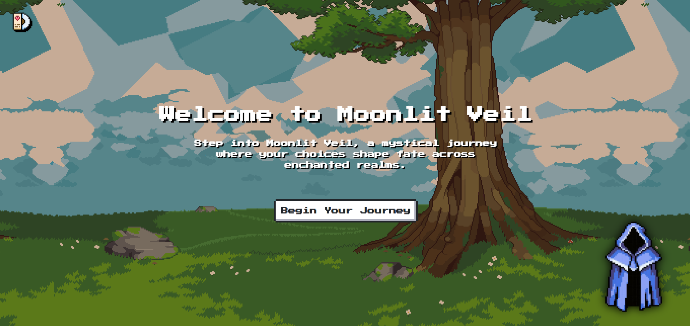
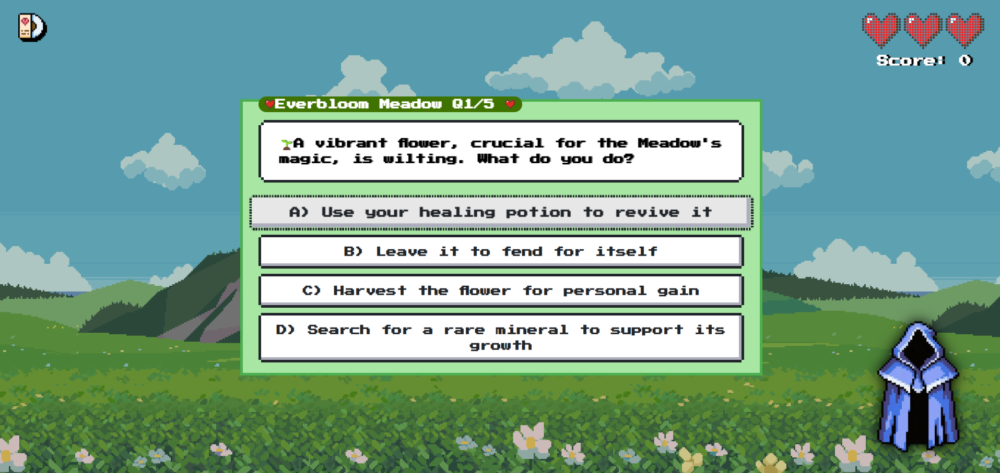
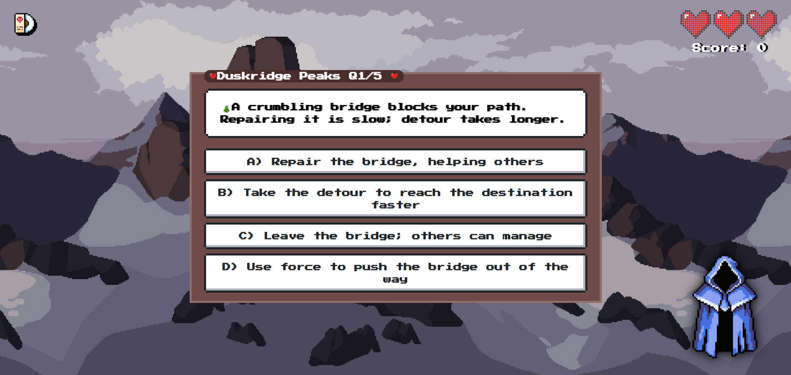
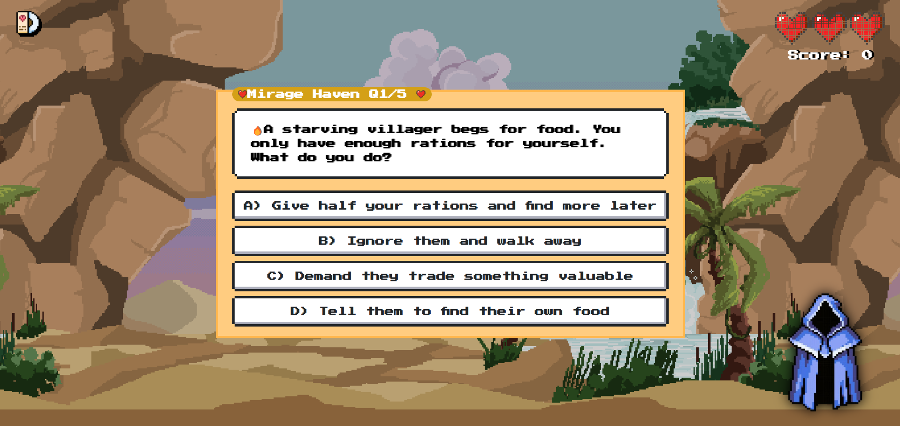
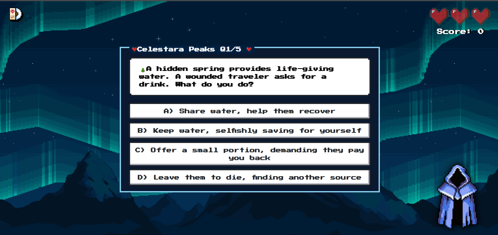
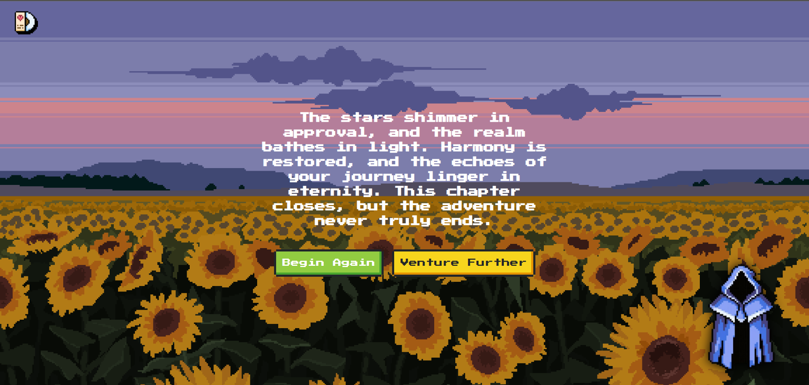
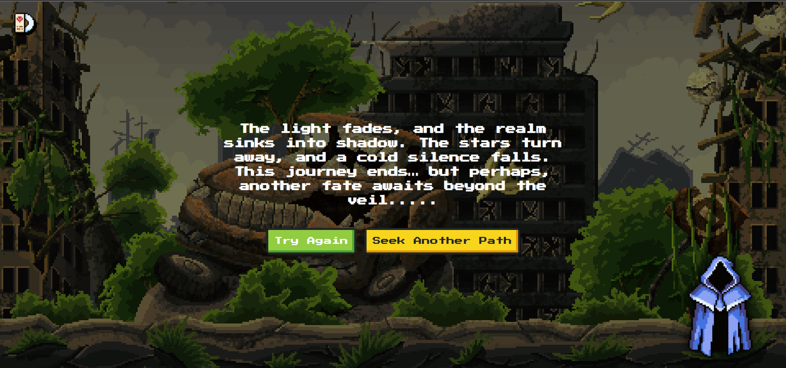

# 🌙 Moonlit Veil

**Moonlit Veil** is a 2D mystical pixel-themed choice game where players traverse enchanting realms, answer thought-provoking quizzes, and shape their destiny. The game blends storytelling, climate-conscious challenges, and a unique art style for an unforgettable experience.

> 🌐 [Play Now](https://www.moonlit-veil.xyz)  

---

## 🧩 Gameplay Overview

- 🌸 **Explore 5 Themed Realms**  
  Travel through surreal landscapes, meet charismatic NPCs, and face quizzes disguised as moral dilemmas.

- 💬 **Dynamic Quizzes Powered by Gemini API**  
  Each realm presents 10 unique questions related to real-world climate and social issues.

- 🧠 **Choice-Driven Narrative**  
  Your decisions and performance determine the ending.

- 💖 **Scoring System**
  - ✅ Correct Answer: +3 points  
  - ❌ Incorrect Answer: -10 points & lose 1 heart  
  - 💔 Lose all 3 hearts = Game Over

- 🏆 **Leaderboard Support**  
  Compete globally with Firebase-powered score tracking.

- 👤 **Simple Sign-In**  
  No Google sign-in—just enter a username and dive in.

---

## 🎨 Realms & Themes

| Realm | Description |
|-------|-------------|
| **Everbloom Meadow** | Sunny flower fields on grassy hills. |
| **Duskridge Peaks** | Snow-dusted mountains beneath a gloomy sky. |
| **Mirage Haven** | Desertscape with hidden waterfalls and oasis. |
| **Celestara Peaks** | Starry mountains lit by the aurora borealis. |

---

## 🖼️ Gallery

> 📸 A glimpse into the mystical realms of Moonlit Veil.



### 🌸 Everbloom Meadow  


### ❄️ Duskridge Peaks  


### 🌵 Mirage Haven  


### 🌌 Celestara Peaks  


### 📈 Ending
  


---

## 🛠️ Tech Stack

- **Frontend**: React + Vite, Tailwind CSS, JavaScript, `ness.css`
- **AI Questions**: Gemini API
- **Backend**: Firebase (Firestore)
- **Deployment**: Vercel and 

---

## 🔐 Authentication

Players enter a username before playing—no emails or passwords required. This keeps the experience fast and simple.

---

## 🧠 Logic Summary

- If hearts reach 0 → **Bad Ending**
- If all realms are completed with smart choices → **Good Ending**
- Points and decisions affect leaderboard rank and final cutscene.

---

## 📦 Installation (For Local Dev)

```bash
git clone https://github.com/levanter914/Moonlit-Veil.git
cd Moonlit-Veil
npm install
npm run dev
```

## ✨ Future Plans
🌐 Multiplayer quiz mode

🧚 More realms and deeper lore

🧭 Alternate story paths and secrets

## 🙌 Credits
Created with magic by @levanter914
Art, story, and code handcrafted for a dreamy player experience.

## 📬 Feedback & Contributions
Feel free to open issues or PRs for bug fixes, enhancements, or creative ideas.
Let’s make Moonlit Veil even more magical together! 🌙
